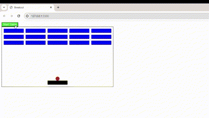

# Breakout Game

Welcome to the Breakout Game repository! This is a classic Breakout game implementation using HTML, CSS, and JavaScript. Breakout is an arcade game where the player controls a paddle to bounce a ball and break bricks at the top of the screen.



## Features

- An interactive web-based game inspired by the classic Breakout arcade game.
- Control a paddle to bounce a ball and break bricks.
- Score tracking to keep track of your performance.
- Option to restart the game for another round of brick-breaking fun by refreshing the page.

## Technologies Used

- HTML
- CSS
- JavaScript

## Getting Started

To play the game locally or online, follow these steps:

1. Clone the repository:

   ```bash
   git clone https://github.com/OzzDm/BreakoutGame.git
   ```

2. Navigate to the project directory:

   ```bash
   cd breakout-game
   ```

3. Open the `index.html` file in your preferred web browser.

## How to Play

1. When you start the game, you will see a board, a ball, and bricks at the top of the screen.
2. Use the left and right arrow keys to move the board.
3. Bounce the ball off the board to break the bricks.
4. Each broken brick earns you points.
5. Be careful not to let the ball fall below the paddle, or you'll lose.
6. Your goal is to score as high as possible by breaking as many bricks as you can.
7. You can choose to restart the game for another round of brick-breaking action.

## Contributing

Contributions are welcome! If you find any bugs or want to add new features to the game, feel free to open an issue or submit a pull request.

When contributing, please follow these guidelines:

- Fork the repository and clone it to your local machine.
- Create a new branch for your feature or bug fix.
- Commit your changes with descriptive commit messages.
- Push your branch to your forked repository.
- Open a pull request explaining the changes you made.

## Acknowledgments

- The Breakout Game is inspired by the classic Breakout arcade game.
- Special thanks to the contributors who have helped make this project better.

Enjoy the game! If you have any questions or feedback, feel free to reach out. Have a great time breaking those bricks!